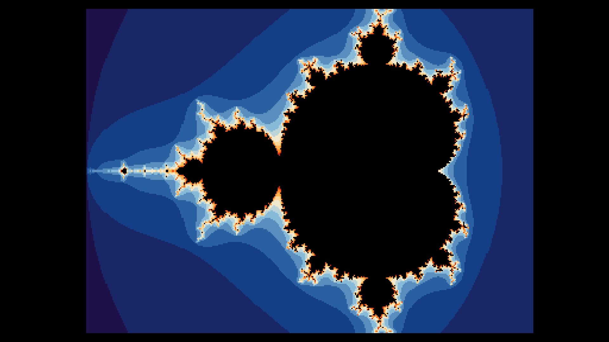
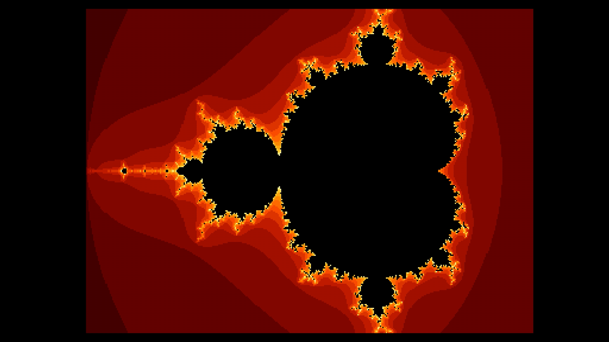
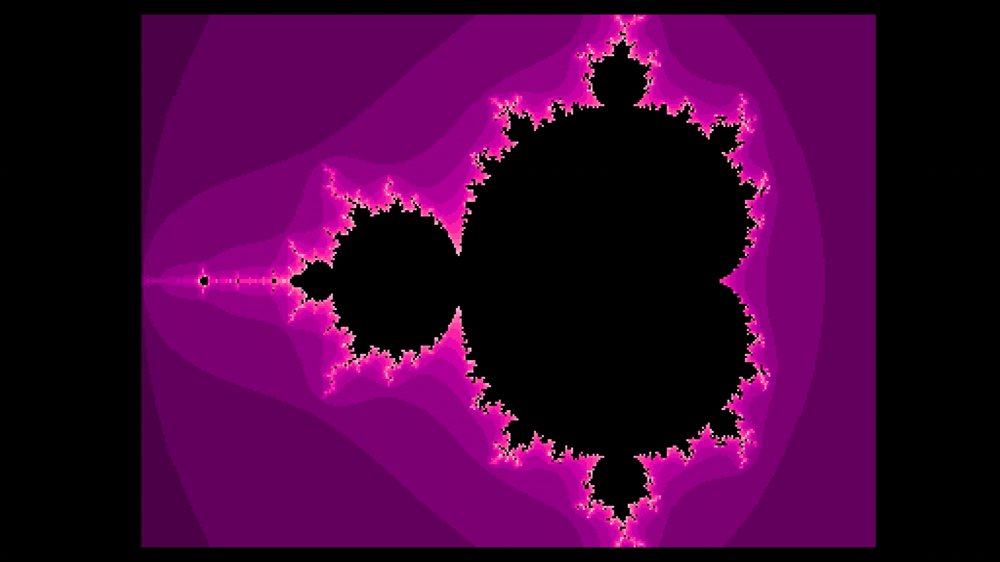
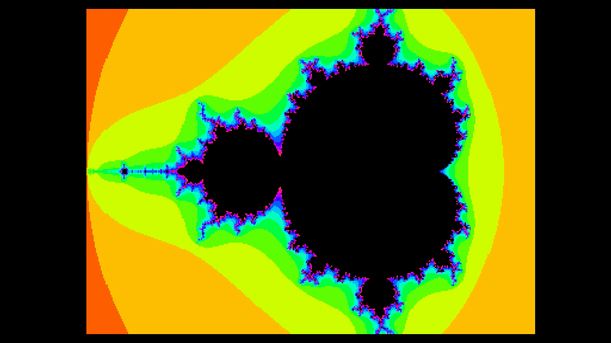
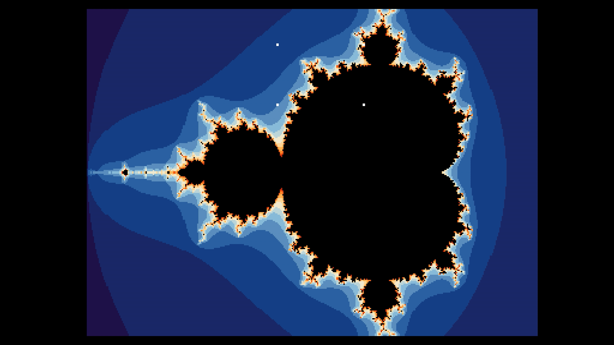
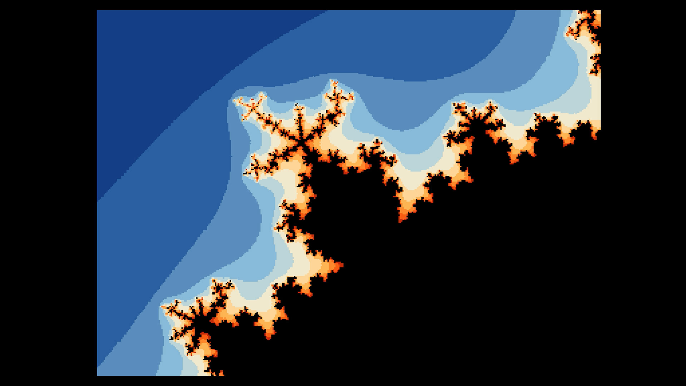

# Mandelbrot Upic



A Commodore 64 Ultimate demo that generates a Mandelbrot fractal
on-device at 64 MHz turbo, packs it directly into Upic format (a
16-color, 384x256 border-color raster picture technique), displays it
live as it renders, and lets you interactively pan around and zoom
into any region of the result.

See `CREDITS.md` for full attribution.

**Status**: v1.0.2, feature-complete and confirmed working on real
Ultimate 64 hardware (firmware 3.15 and 3.15a).

**[Watch it in action](https://www.youtube.com/watch?v=fWSM7ikNegw)**
-- real-hardware capture: live generation, all 4 palettes, and
interactive zoom.

## Contents

- [Controls](#controls)
- [Installation](#installation)
- [Building from source](#building-from-source)
- [Documentation](#documentation)
- [Changelog](CHANGELOG.md)
- [Credits](CREDITS.md)

## Controls

Generation starts automatically on launch and the picture builds up
live, left to right. Once it completes, you're in **browse mode**:

| Input | Action |
|---|---|
| `W`/`A`/`S`/`D` | Pan the current view (no-op at the default overview -- nothing to pan to) |
| Cursor keys (hold Shift for up/left) | Same, alternative for muscle memory |
| `Z` | Enter box mode to pick a zoom target |
| `O` | Zoom out one notch (widens the view, clamped to the original overview) |
| `C` | Cycle the base color gradient (sunset, fire, amethyst, rainbow) |

Panning regenerates the fractal at the same zoom level, shifted --
each step is a fraction of the current view's own size, so it moves
less in absolute terms the deeper you've zoomed in.

The 4 selectable gradients:





Press `Z` to enter **box mode**: 4 corner markers (solid white 2x2
blocks) appear, outlining a box that always keeps the picture's own
3:2 aspect ratio:



| Input | Action |
|---|---|
| `W`/`A`/`S`/`D` | Move the whole box |
| Cursor keys (hold Shift for up/left) | Same, alternative for muscle memory |
| `+` | Grow the box (aspect ratio unchanged) |
| `-` | Shrink the box (aspect ratio unchanged) |
| `RETURN` | Confirm and zoom into the box |
| `Z` | Cancel back to browse mode without zooming |
| `C` / `O` | Same as browse mode |

Confirming regenerates the fractal at the selected region and returns
to browse mode. Repeated zooms compose relative to whatever's
currently displayed, so zooming, panning, and zooming again all work
together.



**Zoom precision limit**: the fractal coordinates use a fixed-point
format with a finite number of fractional bits, capping how far
repeated zooming can go (roughly 16x total from the initial view)
before individual pixel steps round down to zero and the picture stops
changing with further zoom. This is a hard limit of the current
implementation, not a bug -- see `docs/MANDELBROT_ALGORITHM.md`.

**No quit key** -- reset or power off to exit, same as many C64 demos
with no graceful exit path. See `docs/ZOOM_FEATURE.md` for why.

## Installation

Requires **firmware 3.15 or newer**. As of this release, that means an
**Ultimate 64 Elite 2** in practice -- the corresponding firmware for
the original Ultimate 64 (C64U) board hasn't been released yet.

1. Copy both `mandelupic.prg` and `mandelupic.cfg` onto your Ultimate's
   SD card or USB storage, in the same folder -- extracting the
   release ZIP already places them together (at
   `idi8b/mandelupic/`), or `make deploy`/`make zip` produce them from
   source with matching names.
2. Run `mandelupic.prg` from the Ultimate's file browser.

The Ultimate's own firmware auto-loads a config file that shares its
base name with the program being run -- `mandelupic.cfg` next to
`mandelupic.prg` is picked up automatically, no manual "load config"
step needed. It enables the Command Interface (UCI) and U64 turbo
registers this demo needs (for an Ultimate 64 Elite 2 board); if your
own configuration already has both enabled, this has no effect either
way.

## Building from source

### Prerequisites

| Tool | Purpose | Install |
|---|---|---|
| [Oscar64](https://github.com/drmortalwombat/oscar64) | C cross-compiler targeting 6502/C64 | build from source, see their README |
| `wput` | FTP deploy to the Ultimate device | `sudo apt install wput` |
| `pandoc` + `texlive-xetex` | Generate `README.pdf` (optional) | `sudo apt install pandoc texlive-xetex` |

### Deploy setup

Copy `.env.example` to `.env` and set `ULTIP1` to your Ultimate
device's IP address:
```
cp .env.example .env
```

### Make targets

| Target | Effect |
|---|---|
| `make` / `make all` | Compile to `build/mandelupic.prg`, regenerate `README.pdf`, build the release ZIP |
| `make deploy` | FTP the compiled `.prg` and matching `.cfg` to the Ultimate device set in `.env` |
| `make docs` | Regenerate `README.pdf` via pandoc |
| `make clean` | Remove build outputs |

## Documentation

| Document | Covers |
|---|---|
| [`docs/ARCHITECTURE.md`](docs/ARCHITECTURE.md) | Program flow, components, memory layout overview |
| [`docs/MANDELBROT_ALGORITHM.md`](docs/MANDELBROT_ALGORITHM.md) | Fixed-point fractal generation algorithm |
| [`docs/UPIC_VIEWER.md`](docs/UPIC_VIEWER.md) | The Upic border-color raster display technique |
| [`docs/ZOOM_FEATURE.md`](docs/ZOOM_FEATURE.md) | Interactive pan/zoom/palette control scheme |
| [`TURBOCONTROLMANUAL.md`](TURBOCONTROLMANUAL.md) | Ultimate 64 CPU speed control library |
| [`UCILIBMANUAL.md`](UCILIBMANUAL.md) | Ultimate Command Interface (UCI) protocol library |
| [`CHANGELOG.md`](CHANGELOG.md) | Version history |
| [`CREDITS.md`](CREDITS.md) | Full attribution |
